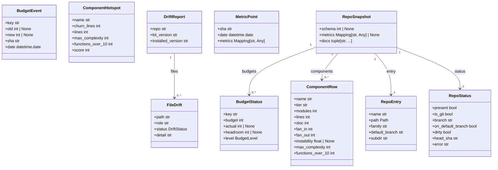

<!-- AUTOGENERATED by tests/guardrail — do not edit by hand.
     Regenerate with `make diagrams` (or `pytest tests/guardrail`). -->

# Domain model

## Models

```mermaid
classDiagram
  class BudgetEvent {
    +key str
    +old int | None
    +new int | None
    +sha str
    +date datetime.date
  }
  class BudgetStatus {
    +key str
    +budget int
    +actual int | None
    +headroom int | None
    +level BudgetLevel
  }
  class ComponentHotspot {
    +name str
    +churn_lines int
    +lines int
    +max_complexity int
    +functions_over_10 int
    +score int
  }
  class ComponentRow {
    +name str
    +tier str
    +modules int
    +lines int
    +sloc int
    +fan_in int
    +fan_out int
    +instability float | None
    +max_complexity int
    +functions_over_10 int
  }
  class DriftReport {
    +repo str
    +kit_version str
    +installed_version str
  }
  class FileDrift {
    +path str
    +role str
    +status DriftStatus
    +detail str
  }
  class MetricPoint {
    +sha str
    +date datetime.date
    +metrics Mapping[str, Any]
  }
  class RepoEntry {
    +name str
    +path Path
    +family str
    +default_branch str
    +subdir str
  }
  class RepoSnapshot {
    +schema int | None
    +metrics Mapping[str, Any] | None
    +docs tuple[str, ...]
  }
  class RepoStatus {
    +present bool
    +is_git bool
    +branch str
    +on_default_branch bool
    +dirty bool
    +head_sha str
    +error str
  }
  DriftReport "1" --> "0..*" FileDrift : files
  RepoSnapshot "1" --> "0..*" BudgetStatus : budgets
  RepoSnapshot "1" --> "0..*" ComponentRow : components
  RepoSnapshot "1" --> "1" RepoEntry : entry
  RepoSnapshot "1" --> "1" RepoStatus : status
```
